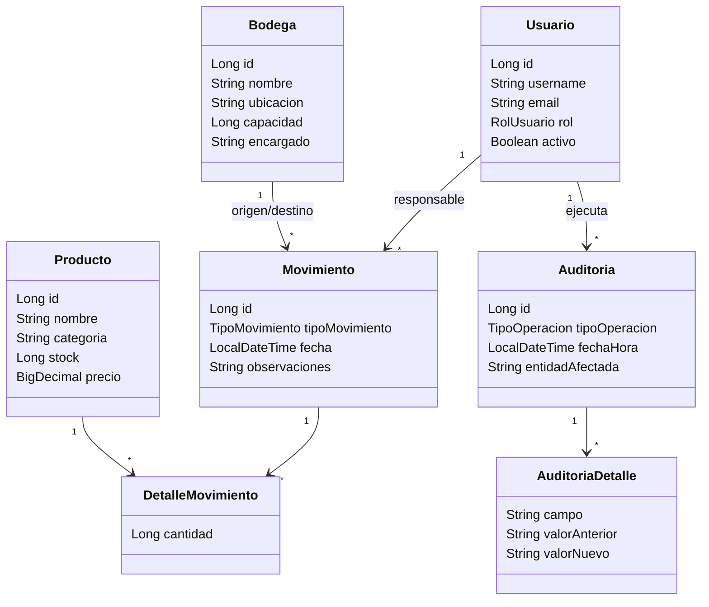

# LogiTrack — Sistema de Gestión de Inventario con Roles

LogiTrack centraliza la administración de bodegas, productos y movimientos de inventario para una empresa con operaciones distribuidas. La aplicación reemplaza el control manual en hojas de cálculo por una API REST segura, trazable y con auditoría de cambios.

Incluye un frontend web estático para iniciar sesión, consultar información y operar las secciones permitidas según el rol del usuario.

## 1. Objetivos del proyecto

- Aplicar una arquitectura organizada por controladores, servicios, repositorios y modelos.
- Implementar autenticación stateless mediante JWT con Spring Security.
- Aplicar control de acceso basado en roles (RBAC) para ADMIN y EMPLEADO.
- Diseñar y consumir endpoints REST con operaciones CRUD y filtros.
- Persistir información con Spring Data JPA y MySQL.
- Implementar validaciones, manejo global de excepciones y respuestas JSON.
- Registrar auditoría de operaciones y generar reportes de inventario.
- Documentar y probar la API con Swagger/OpenAPI y Postman.

## 2. Tecnologías utilizadas

### Backend

- Java 17
- Maven
- Spring Boot 4.1.1
- Spring Web MVC
- Spring Data JPA / Hibernate
- Spring Security
- JSON Web Token (JJWT 0.12.6)
- Bean Validation
- Lombok
- Swagger/OpenAPI 3 con Springdoc

### Frontend

- HTML5
- CSS3
- JavaScript Vanilla
- Fetch API para consumir el backend sin recargar la página

### Base de datos

- MySQL
- Base de datos configurada: `logitrack_db`
- [schema.sql](schema.sql) y [data.sql](data.sql)

## 3. Arquitectura y estructura del proyecto

El proyecto utiliza una arquitectura por capas dentro de `inventory-service/src/main/java/com/Springboot_project/inventory_service/`:

```text
src/
├── main/
│   ├── java/com/Springboot_project/inventory_service/
│   │   ├── config/          Configuración de OpenAPI y aplicación
│   │   ├── controller/      Endpoints REST
│   │   ├── dto/             Objetos de entrada y salida de la API
│   │   ├── exception/       Excepciones y manejo global de errores
│   │   ├── mapper/          Conversión entre entidades y DTOs
│   │   ├── model/           Entidades y enumeraciones del dominio
│   │   ├── repository/      Persistencia con Spring Data JPA
│   │   ├── security/        JWT, usuarios y configuración de seguridad
│   │   └── service/         Interfaces y lógica de negocio
│   └── resources/
│       ├── application.properties
│       └── static/
│           ├── index.html
│           ├── css/style.css
│           └── js/app.js
└── test/
```

Los controladores reciben las solicitudes HTTP, los servicios aplican las reglas de negocio, los repositorios acceden a MySQL y los DTOs mantienen separada la representación de la API de las entidades persistentes. El frontend se sirve desde los recursos estáticos de Spring Boot.

## 4. Roles de usuario y permisos

| Rol | Permisos |
|---|---|
| **ADMIN** | Acceso completo a bodegas, productos, movimientos, usuarios y auditoría. Puede crear, consultar, actualizar y eliminar los recursos permitidos por cada endpoint. |
| **EMPLEADO** | Puede consultar y operar bodegas, productos y movimientos según las reglas del backend. No tiene acceso a usuarios ni auditoría; esas secciones se ocultan en el frontend y las rutas son bloqueadas por Spring Security. |

Si un usuario intenta ejecutar una acción no autorizada, la API responde con `403 Forbidden` y el frontend muestra: **“Error: Sus permisos son insuficientes para realizar esta acción.”**

## 5. Endpoints principales

### Autenticación

- `POST /auth/login`
- `POST /auth/register`

### Bodegas

- `GET|POST /api/bodegas`
- `GET|PUT|DELETE /api/bodegas/{id}`
- `GET /api/bodegas/buscar?nombre=...`
- `GET /api/bodegas/ubicacion?ubicacion=...`

### Productos

- `GET|POST /api/productos`
- `GET|PUT|DELETE /api/productos/{id}`
- `GET /api/productos/buscar?nombre=...`
- `GET /api/productos/stock-bajo`
- Filtros por precio en `/api/productos/filtrar/...`

### Movimientos y reportes

- `GET|POST /api/movimientos`
- `GET /api/movimientos/{id}`
- `GET /api/movimientos/rango-fechas?inicio=...&fin=...`
- `GET /api/movimientos/reporte-general`

### Usuarios y auditoría

- `GET|POST /api/usuarios`
- `GET /api/usuarios/{id}`
- `PATCH /api/usuarios/{id}/desactivar`
- `GET /api/usuarios/username/{username}`
- `GET /api/usuarios/rol/{rol}`
- `GET /api/auditoria`
- `GET /api/auditoria/usuario/{usuarioId}`
- `GET /api/auditoria/tipo/{tipoOperacion}`

## 6. Ejemplos de uso de la API

### Iniciar sesión y obtener el JWT

```http
POST http://localhost:8080/auth/login
Content-Type: application/json

{
  "username": "admin.logitrack",
  "password": "admin123"
}
```

La respuesta incluye `token`, `username` y `rol`. Usa el valor de `token` en las solicitudes protegidas:

```http
GET http://localhost:8080/api/productos
Authorization: Bearer <TOKEN>
```

### Crear un producto

```http
POST http://localhost:8080/api/productos
Authorization: Bearer <TOKEN>
Content-Type: application/json

{
  "nombre": "Teclado mecánico",
  "categoria": "Periféricos",
  "stock": 25,
  "precio": 180000
}
```

### Registrar una entrada de inventario

```http
POST http://localhost:8080/api/movimientos
Authorization: Bearer <TOKEN>
Content-Type: application/json

{
  "tipoMovimiento": "ENTRADA",
  "bodegaDestinoId": 1,
  "observaciones": "Recepción de proveedor",
  "detalles": [
    {
      "productoId": 1,
      "cantidad": 10
    }
  ]
}
```

### Consultar reportes y filtros

```http
GET http://localhost:8080/api/productos/stock-bajo
Authorization: Bearer <TOKEN>

GET http://localhost:8080/api/movimientos/reporte-general
Authorization: Bearer <TOKEN>

GET http://localhost:8080/api/movimientos/rango-fechas?inicio=2026-08-01T00:00:00&fin=2026-08-31T23:59:59
Authorization: Bearer <TOKEN>
```

## 7. Diagrama de clases y arquitectura



La capa `controller` expone la API REST; `service` concentra las reglas de negocio; `repository` gestiona la persistencia; `model` contiene las entidades y enums; `dto` define los contratos HTTP; `mapper` transforma entidades; `security` implementa JWT y RBAC; y `exception` centraliza los errores. El frontend se sirve desde los recursos estáticos de Spring Boot.

## 8. Capturas de Swagger y pruebas

La documentación interactiva está disponible en:

- Swagger UI: [http://localhost:8080/swagger-ui.html](http://localhost:8080/swagger-ui.html)
- OpenAPI JSON: [http://localhost:8080/v3/api-docs](http://localhost:8080/v3/api-docs)

Para probar login, JWT, roles, CRUD, filtros, movimientos y auditoría, importa la colección [LogiTrack.postman_collection.json](./inventory-service/LogiTrack.postman_collection.json) y consulta la guía [JWT_explicacion.md](./inventory-service/JWT_explicacion.md).

Las capturas de Swagger y Postman deben tomarse con la aplicación y MySQL ejecutándose. Este checkout no contiene archivos de imagen de capturas; al agregarlos, se recomienda guardarlos en `docs/screenshots/` y enlazarlos aquí, por ejemplo:

```markdown


```

## 9. Frontend

El frontend funcional está dentro del proyecto Spring Boot y consume la API con `fetch`:

```text
inventory-service/src/main/resources/static/
├── index.html
├── css/style.css
└── js/app.js
```

Incluye login y registro, navegación lateral por secciones, control visual por rol, tablas de bodegas/productos/movimientos/usuarios/auditoría, filtros, modales CRUD, estados de carga y notificaciones de error o éxito. No existe actualmente una carpeta independiente llamada `frontend/`.

## 10. Requisitos e instalación local

### Requisitos previos

- JDK 17 o superior
- MySQL 8 o compatible
- Git
- Maven 3+ opcional; el proyecto incluye Maven Wrapper

### Base de datos

1. Crea la base de datos MySQL usando [schema](schema.sql) y [data.sql](data.sql). ! Puede que el usuario en auditoria de null ya que los datos no accionan los eventos del trigger, para ver simplemente tienes que usar un endpoint ya autenticado.
2. Configura usuario, contraseña y demás parámetros en `inventory-service/src/main/resources/application.properties`. puedes usar ```py -c "import secrets; print(secrets.token_urlsafe(48))"``` para el jwt secret.

3. Asegúrate de que las tablas y usuarios de prueba existan antes de iniciar la aplicación.

Este checkout no incluye actualmente archivos `schema.sql` ni `data.sql`; por ello, la creación de tablas y la carga de datos deben realizarse con el esquema disponible en tu entorno.

### Clonar, compilar y ejecutar

```bash
git clone https://github.com/sephty/Logitrack_SpringbootD1_Joseph.git
cd Logitrack_SpringbootD1_Joseph/inventory-service
./mvnw clean install
./mvnw spring-boot:run
```

En Windows PowerShell:

```powershell
git clone https://github.com/sephty/Logitrack_SpringbootD1_Joseph.git
Set-Location Logitrack_SpringbootD1_Joseph\inventory-service
.\mvnw.cmd clean install
.\mvnw.cmd spring-boot:run
```

### URLs locales

- Aplicación web: [http://localhost:8080](http://localhost:8080)
- Swagger UI: [http://localhost:8080/swagger-ui.html](http://localhost:8080/swagger-ui.html)
- OpenAPI JSON: [http://localhost:8080/v3/api-docs](http://localhost:8080/v3/api-docs)

Para probar JWT y todos los endpoints, importa la colección [LogiTrack.postman_collection.json](./inventory-service/LogiTrack.postman_collection.json). La explicación de uso está en [JWT_explicacion.md](./inventory-service/JWT_explicacion.md).

## 11. Credenciales de prueba

Las siguientes credenciales aparecen preconfiguradas en la colección Postman y requieren que los usuarios correspondientes estén cargados en la base de datos local:

| Rol | Usuario | Contraseña |
|---|---|---|
| ADMIN | `admin.logitrack` | `admin123` |
| EMPLEADO | `carlos.rojas` | `carlos123` |

El registro público (`POST /auth/register`) crea usuarios con rol `EMPLEADO`. Un usuario ADMIN autenticado puede crear usuarios con el endpoint administrativo de usuarios.
